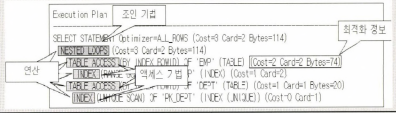

# 2과목 : SQL 기본 및 활용

## 제3장 SQL 최적화 기본 원리

1. 실행계획 정보의 구성요소

   

2. Sort Merge Join

   **Sort Merge Join**은 조인 컬럼을 기준으로 데이터를 정렬하여 조인을 수행한다. 
   NL Join은 주로 랜덤 액세스 방식으로 데이터를 읽는 반면 Sort Merge Join은 주로 스캔 방식으로 데이터를 읽는다. Sort Merge Join은 랜덤 액세스로 NL join에서 부담이 되던 넓은 범위의 데이터를 처리할 때 이용되던 조인 기법이다. 
   그러나 Sort Merge Join은 정렬할 데이터가 많아 메모리에서 모든 정렬 작업을 수행하기 어려운 경우에는 임시 영역(디스크)을 사용하기 때문에 성능이 떨어질 수 있다.

3. Hash Join

   Hash Join은 조인 컬럼의 인덱스를 사용하지 않기 때문에 조인 칼럼의 인덱스가 존재하지 않을 경우에도 사용할 수 있는 조인 기법이다. Hash Join은 해쉬 함수를 이용하여 조인을 수행하기 때문에 '='로 수행하는 조인 즉, 동등 조인에서만 사용할 수 있다.